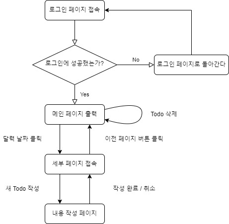

# TODO-Calendars
### 달력 형태로 한 눈에 알아볼 수 있는 투두 리스트

---
## 개요
2022년 1학기 클라우드 프로그래밍 프로젝트입니다.

## 내용
달력 형태의 메인 페이지에 할 일들을 작성하고, 그 일들을 얼마나 잘 수행했는지 확인하도록 하기 위한 프로젝트이다.
달력의 각 날짜를 클릭하였을 경우 세부적인 내용을 확인하거나 작성할 수 있다.

## 사용 기술
* Django
* KT PaaS-TA

## 플로우 다이어그램
